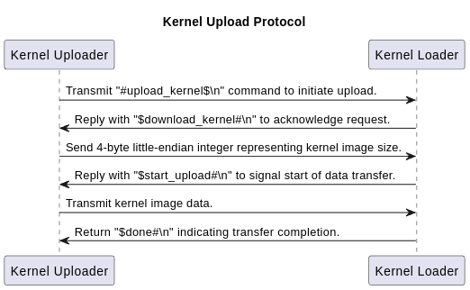

# Note

## Self-Relocation 實做手法

- linker 裡面設定變數來計算 kernel loader 的大小
- 設定一個預估夠大的 offset 讓複製的 kernel loader 不會與 kernel 有重疊的記憶體位址。
- 把整個 kernel loader 的每個 byte 依照 offset 複製到對應的位置
- 進入 kernel loader 的 main 的時候先把位置加上 offset，用來跳轉到複製後的位址

我的實做使用的 offset 是 `-0x20000`

## 溝通用的 protocol

