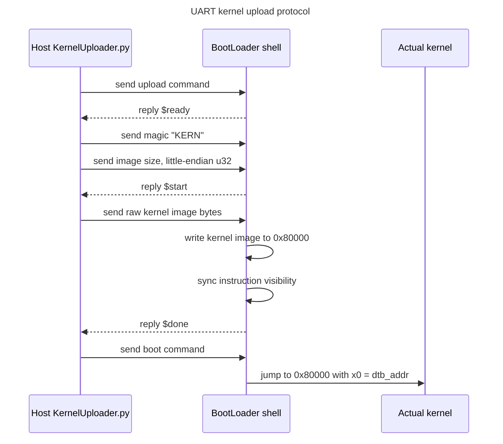

# Lab 2 Note

Lab 2 的目標是把 Lab 1 的互動式 kernel 延伸到更完整的 booting 流程。這次會先直接做
一個 self-relocating UART bootloader：firmware 可以照預設把 bootloader 載入
`0x80000`，bootloader 啟動後先搬移自己，再透過 UART 載入真正的 kernel image 並跳轉。
接著讓 kernel 能讀取 initial ramdisk 裡的檔案，並加入 early boot 階段可用的 simple
allocator。最後再處理 flattened devicetree parser。

## Bootloader 與 Kernel Image

Raspberry Pi firmware 開機時會從 SD card 載入指定的 image，然後跳進去執行。在
Lab 1 中，這個 image 就是 kernel 本身，也就是 `kernel8.img`。每次修改 kernel 後，都
需要重新把新的 image 放到 SD card；實機除錯時，這代表會頻繁拔插 SD card。

Lab 2 引入一個更小的 bootloader 作為第一個被 firmware 載入的程式。bootloader 的任務
不是提供完整 kernel 功能，而是建立最基本的 UART I/O，從 host 接收真正要測試的 kernel
image，將它放到 kernel 預期的執行位址，最後跳轉到 kernel。

```text
Lab 1:
firmware -> kernel8.img

Lab 2:
firmware -> bootloader.img -> receive kernel8.img over UART -> kernel
```

這樣做的主要目的：

| 目的 | 說明 |
| --- | --- |
| 降低實機除錯成本 | bootloader 固定放在 SD card，之後只要透過 UART 傳新的 kernel |
| 分離載入與 kernel 本體 | bootloader 負責傳輸與跳轉，kernel 可以維持自己的 entry/layout |
| 支援後續 boot 資料 | initramfs、dtb 等資料會逐步納入 boot flow |
| 練習真實 boot chain | 實際系統常有多階段 bootloader，而不是 firmware 直接載入完整 OS |

actual kernel 仍希望放在 `0x80000` 執行；但 firmware 預設也會把第一個 image 載入
`0x80000`，因此 bootloader 和 kernel 會競爭同一段記憶體。basic 作法是用
`config.txt` 把 bootloader 載到別的位置；本筆記後續直接採 self-relocating bootloader，
讓 bootloader 啟動後先搬移自己，再把 `0x80000` 留給真正的 kernel。

## 實作總覽

建議把 Lab 2 拆成這幾個項目完成：

| 項目 | 主要任務 | 可能檔案 |
| --- | --- | --- |
| Self-relocating UART bootloader | 啟動後搬移 bootloader，透過 UART 接收 kernel image，寫入 `0x80000` 後跳轉 | `boot.S`, `main.c`, `mini_uart.*`, `linker.ld` |
| Initial ramdisk | 建立 cpio archive，kernel 解析 newc 格式並讀取檔案內容 | `cpio.*`, `shell.c`, `makefile`, `rootfs/` |
| Simple allocator | 在 early boot 階段提供只配置、不釋放的連續記憶體配置器 | `allocator.*`, `linker.ld`, `config.h` |
| Devicetree | 解析 FDT，遍歷 nodes/properties，從 dtb 取得 initramfs 位址 | `fdt.*`, `boot.S`, `main.c` |
| Build and run | 分別建置 bootloader、kernel、initramfs，使用 QEMU 和實機驗證 | `makefile`, `config.txt` |

建議實作順序：

1. 先確認 Lab 1 kernel 在 Lab 2 目錄中仍可 build/run。
2. 直接完成 self-relocating UART bootloader end-to-end。
3. 建立 `initramfs.cpio`，先用 hardcoded address 解析 newc archive。
4. 加入 shell command 來列出檔案與讀取指定檔案內容。
5. 實作 simple allocator，將需要 early allocation 的資料改成透過它取得。
6. 最後解析 devicetree，改由 dtb 取得 initramfs 載入範圍，並讓 bootloader 傳遞 dtb address。

## UART Bootloader

Lab 2 的 basic exercise 1 要實作一個被 Raspberry Pi firmware 載入的 bootloader；
advanced exercise 1 則要求 bootloader 可以 self relocate。這份筆記後續直接採用
self-relocating bootloader path，不另外維護 `kernel_address=0x60000` 的 basic-only
版本。

```text
firmware -> bootloader at 0x80000
         -> copy bootloader to safe address
         -> continue at relocated bootloader
         -> UART receive kernel8.img to 0x80000
         -> jump to kernel
```

### Basic Alternative

basic-only 作法可以用 `config.txt` 要求 firmware 把 bootloader 放到其他位置，避免它和
actual kernel 的 `0x80000` 載入位址重疊：

```text
kernel_address=0x60000
kernel=bootloader.img
arm_64bit=1
```

但本 lab 後續不走這條路線；我們直接讓 bootloader 支援 relocation，因此不需要依賴
`kernel_address=`。

若要在 QEMU 模擬 basic-only 的「把 loader 放到別的位置」作法，可以不用 `-kernel`，
改用 generic loader device 指定位址，例如：

```bash
qemu-system-aarch64 -M raspi3b -display none -serial null -serial stdio \
    -device loader,file=bootloader.img,addr=0x60000,cpu-num=0
```

這條路線只作為對照；目前主線仍是 self-relocating bootloader。

### Self Relocation

bootloader 一開始可以被載入到 `0x80000`。為了稍後把 actual kernel image 寫回
`0x80000`，bootloader 必須先把自己搬到安全位置，並跳到 relocated code 繼續執行。

第一版設計先保持固定 memory map：

| 項目 | 位址 |
| --- | --- |
| Original bootloader load address | `0x80000` |
| Relocated bootloader address | `0x60000` |
| Actual kernel load address | `0x80000` |

實作時需要特別釐清：

- bootloader image 的起訖 linker symbols。
- relocation destination 是否會和 stack、kernel、initramfs、dtb 重疊。
- copy range 要包含繼續執行所需的 `.text`、`.rodata`、`.data`，並處理 `.bss` 狀態。
- copy 完成後如何跳到 relocated code 的對應位置。
- relocation 前後 absolute address、literal pool、global data 是否仍正確。
- 開始寫 `0x80000` 前，bootloader 必須已經不依賴原位置內容。

目前 bootloader 獨立放在 repo 根目錄的 `BootLoader/`，不是放在單一 lab 裡。這樣後續
Lab 3 之後仍可沿用同一個 UART loader，只要各 lab 產出自己的 actual kernel image。
`BootLoader/src/linker.ld` 將 bootloader link 在 `0x60000`，但 firmware/QEMU 仍會把
raw image 載到 `0x80000`。`BootLoader/src/boot.S` 早期會把整個 bootloader 從
`0x80000` copy 到 `0x60000`，清 relocated `.bss`，設定 stack，最後跳到 relocated
`bootloader_main`。

### UART Transfer Protocol

spec 只要求透過 UART 載入 binary，協定可以保持簡單。目前 bootloader 先進入互動式
shell，讓畫面停在 `(bootloader)$ ` prompt。使用者可以輸入 `help` 確認目前仍在
bootloader；輸入 `upload` 後才進入 binary transfer protocol，輸入 `boot` 後才跳到
actual kernel。

| Command | 行為 |
| --- | --- |
| `help` | 顯示 bootloader commands |
| `upload` | 透過 UART 接收 kernel image |
| `boot` | 跳轉到已載入的 kernel |



`upload` 使用固定的 host-to-loader protocol：

| 欄位 | 用途 |
| --- | --- |
| Magic | 4 bytes，ASCII `KERN` |
| Image size | 4-byte little-endian kernel image size |
| Payload | raw kernel image |

bootloader 會用簡單文字 token 回報狀態：

| Token | 意義 |
| --- | --- |
| `$ready#` | bootloader 已進入 upload command，host 可以開始送 magic/size |
| `$start#` | magic/size 驗證完成，host 可以送 payload |
| `$done#` | payload 接收完成，回到 `(bootloader)$ ` prompt |
| `$bad_magic#` | magic 不符 |
| `$bad_size:<hex>#` | size 為 0 或超過上限 |

Host 端 uploader 放在 repo 根目錄的 `KernelUploader.py`，不混進 `BootLoader/`。常用方式：

```bash
make lab2 SERIAL_PORT=/dev/ttyUSB0
python3 KernelUploader.py --kernel ./Lab2/c/bin/kernel8.img --port /dev/ttyUSB0
```

### Jump to Kernel

接收完成後，bootloader 需要跳到 actual kernel 的 entry address：

```c
typedef void (*kernel_entry_t)(uint64_t dtb_addr);

kernel_entry_t kernel = (kernel_entry_t)0x80000;
kernel(dtb_addr);
```

實作時要注意：

- 跳轉前應確保 UART 接收已完成。
- 若有 cache 或 barrier 相關設定，需確認 image writes 對後續 instruction fetch 可見。
- 進入 kernel 前的 register contract 要和後續需求一致；devicetree 進階題會需要傳遞 `x0`。
- stack 不能放在即將被 kernel image 覆蓋的區域。

### Host Sender

Host sender 不屬於 `BootLoader/`，而是根目錄共用工具 `KernelUploader.py`。它使用
`pyserial` 開啟 serial port，只負責 upload 與可選的 `boot`，不接管後續 kernel shell
互動。流程是等待 `(bootloader)$ ` prompt，送出 `upload` command，等待 `$ready#`，
送出 `KERN + size + payload`，等待 `$start#` 後傳 kernel image，最後確認 `$done#`。
預設會自動送 `boot`，如果只要上傳不跳轉可加 `--no-boot`。進入 kernel 後若要互動，
仍使用 `make run` 或 `screen`。

QEMU 可用 pseudo TTY 測試：

```bash
qemu-system-aarch64 -serial null -serial pty ...
```

實機使用注意：

- SD card boot partition 的 `kernel8.img` 應該放 `BootLoader/bin/kernel8.img`，不是各 lab 的
  actual kernel image。
- `make run` 目前會用 `sudo screen` 開 serial；在 screen 裡 `Ctrl-a d` 是 detach，不是
  關閉，detached screen 仍會佔住 `/dev/ttyUSB0` 並吃掉 UART 輸出。
- 離開 screen 時使用 `Ctrl-a k` 再按 `y`，或用 `sudo screen -ls` 找 session 後執行
  `sudo screen -X -S <session> quit`。
- 若 uploader 讀不到 `(bootloader)$ `，先檢查 `sudo fuser -v /dev/ttyUSB0` 與
  `sudo screen -ls`。
- 長期建議把使用者加入 `dialout` group，避免 uploader 和 screen 都需要 `sudo`。

## Initial Ramdisk

Basic exercise 2 要讓 kernel 解析 initial ramdisk。由於目前還沒有 filesystem 與 storage
driver，initramfs 會由 bootloader 或 QEMU 預先放到記憶體中，kernel 只需要從記憶體裡
解析 archive。

```text
initramfs.cpio in memory -> cpio parser -> find pathname -> file content
```

### 建立 Cpio Archive

Lab 2 使用 New ASCII Format Cpio，也就是 `newc` 格式。可先建立 `rootfs/`，放幾個純文字
檔案測試：

```bash
cd rootfs
find . | cpio -o -H newc > ../initramfs.cpio
cd ..
```

QEMU 載入方式：

```bash
qemu-system-aarch64 ... -initrd initramfs.cpio
```

spec 提到 QEMU 預設會將 cpio archive 載入 `0x8000000`。

Raspberry Pi 3 可在 boot partition 放入 archive，並於 `config.txt` 指定：

```text
initramfs initramfs.cpio 0x20000000
```

### Newc Format Parser

每個 entry 由 header、pathname、file content 組成。parser 需要逐筆前進，直到遇到
`TRAILER!!!`。

待補 parser 欄位：

| 欄位 | 用途 |
| --- | --- |
| `c_magic` | 應為 `070701` |
| `c_namesize` | pathname 長度，包含結尾 `\0` |
| `c_filesize` | file content 長度 |
| pathname | entry 名稱，例如 `./hello.txt` |
| content | file data |

newc 的數值欄位是 ASCII hex；header、pathname、content 之間需要依格式做 alignment。
實作時避免把可能未對齊的位址直接 cast 成 typed pointer，先用 byte-wise parsing 較安全。

### Shell Integration

建議加上幾個 command 方便驗證：

| Command | Usage | 行為 |
| --- | --- | --- |
| `ls` | `ls` | 列出 initramfs 中的檔案 |
| `cat` | `cat <path>` | 印出指定檔案內容 |

待補：

- [ ] cpio parser API 設計。
- [ ] pathname 正規化規則，例如是否接受 `hello.txt` 和 `./hello.txt`。
- [ ] archive 結束條件與錯誤處理。
- [ ] `ls` / `cat` command 的實作細節。

## Simple Allocator

Basic exercise 3 要實作 early boot 階段使用的 simple allocator。它只需要提供連續空間，
不需要支援 `free`。

```c
void *simple_malloc(size_t size);
```

建議使用 bump allocator：

```text
heap_begin -> current bump pointer -> heap_end
```

需要決定的設計點：

| 設計點 | 說明 |
| --- | --- |
| Heap 起點 | 可由 linker symbol 或固定安全位址提供 |
| Heap 終點 | 避免覆蓋 kernel、stack、initramfs、dtb |
| Alignment | kernel data 預設以 8-byte alignment 處理 |
| OOM 行為 | 回傳 `NULL` 或直接 panic/hang |

待補：

- [ ] linker symbols 或 config 常數。
- [ ] `simple_malloc` 的 alignment 規則。
- [ ] 使用 allocator 的第一個 call site。
- [ ] OOM 的錯誤訊息與測試方式。

## Devicetree

Advanced exercise 2 要解析 flattened devicetree，也就是 dtb。目標是提供一個可遍歷
device tree 的 API，讓 driver 或 subsystem 能用 callback 檢查每個 node 與 property。
最後要用這個 API 取得 initramfs 的位址，而不是 hardcode。

```text
x0 = dtb address -> fdt parser -> traverse nodes/properties -> find initrd range
```

### Dtb Loading

QEMU 可指定 dtb：

```bash
qemu-system-aarch64 ... -dtb bcm2710-rpi-3-b-plus.dtb
```

Raspberry Pi 3 則把 dtb 放在 SD card boot partition，由 firmware 載入並把 dtb 位址放在
`x0` 傳給 kernel。若使用自己的 bootloader，bootloader 也要把這個位址傳給 actual kernel。

### FDT Parser

待補的 parser 重點：

| 區塊 | 內容 |
| --- | --- |
| Header | magic、totalsize、structure block offset、strings block offset |
| Structure block | begin node、end node、property、nop、end tokens |
| Strings block | property name 字串表 |
| Memory reservation block | 保留記憶體區域 |

遍歷 API 可以先設計成 callback 形式：

```c
void fdt_traverse(void (*callback)(...));
```

實作時要注意 dtb 使用 big-endian 欄位，不能直接用 host/native endian 解讀。

### Initramfs From Dtb

最後要從 devicetree 找出 initramfs 的範圍。待確認的 property 名稱通常會和 chosen node
有關：

| Property | 可能用途 |
| --- | --- |
| `linux,initrd-start` | initramfs 起始位址 |
| `linux,initrd-end` | initramfs 結束位址 |

待補：

- [ ] FDT header validation。
- [ ] structure block token parser。
- [ ] callback API 的參數格式。
- [ ] 讀取 `/chosen` 裡 initramfs 位址。
- [ ] bootloader 傳遞 dtb address 到 kernel 的 register contract。

## Build and Run

Lab 2 會比 Lab 1 多出幾個 artifact：

| Artifact | 用途 |
| --- | --- |
| `BootLoader/bin/kernel8.img` | 由 firmware 載入，負責 UART 載入 actual kernel |
| `kernel8.img` | actual kernel，由 bootloader 載入並跳轉 |
| `initramfs.cpio` | initial ramdisk archive |
| `bcm2710-rpi-3-b-plus.dtb` | Raspberry Pi 3 device tree blob |

待補 Makefile target：

- [x] build bootloader image。
- [x] root uploader target。
- [ ] build kernel image。
- [ ] build initramfs archive。
- [x] run QEMU with UART bootloader。
- [ ] run QEMU with `-initrd`。
- [ ] run QEMU with `-dtb`。

## 驗證紀錄

後續每完成一小段，將實際指令與結果記錄在這裡。

| 項目 | 指令 | 結果 |
| --- | --- | --- |
| Lab 2 initial build | `cd Lab2/c && make` | 通過 |
| BootLoader build | `cd BootLoader && make` | 通過 |
| KernelUploader syntax | `python3 -m py_compile KernelUploader.py` | 通過 |
| Root uploader target dry-run | `make -n lab2` | 顯示會執行 `KernelUploader.py --kernel ./Lab2/c/bin/kernel8.img` |
| KernelUploader with QEMU PTY | QEMU `-serial pty` + `python3 KernelUploader.py -y --port <pty> --kernel ./Lab2/c/bin/kernel8.img` | 上傳並送出 `boot` 成功 |
| BootLoader shell help in QEMU | pipe `help` into QEMU stdio | 顯示 `(bootloader)$` prompt 與 `help/upload/boot` |
| UART bootloader loads Lab2 kernel in QEMU | pipe `upload + KERN + size + Lab2/c/bin/kernel8.img + boot` into QEMU stdio | 跳轉後出現 Lab2 shell |
| UART bootloader on Rpi3 | `make lab2` after booting `BootLoader/bin/kernel8.img` from SD card | 可上傳並進入 kernel shell |
| Initramfs list/read | 待補 | 待補 |
| Simple allocator | 待補 | 待補 |
| Devicetree traversal | 待補 | 待補 |

## 參考資料

- `Lab2/spec.pdf`
- Lab 2 online spec: `https://nycu-caslab.github.io/OSC2024/labs/lab2.html`
- FreeBSD cpio manual: `https://man.freebsd.org/cgi/man.cgi?query=cpio&sektion=5`
- Devicetree specification: `https://www.devicetree.org/specifications/`
- Raspberry Pi Linux devicetree sources:
  `https://github.com/raspberrypi/linux/tree/rpi-6.6.y/arch/arm/boot/dts/broadcom`
