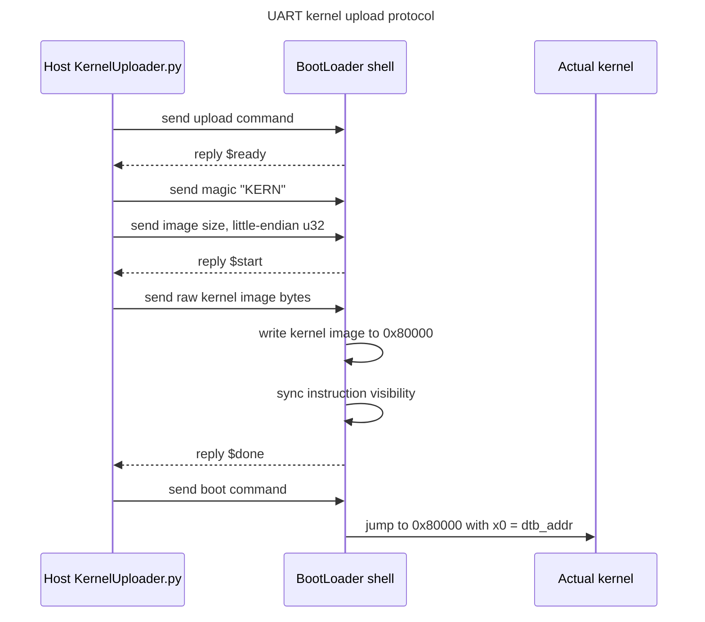

# Lab 2 Note

Lab 2 的目標是把 Lab 1 的互動式 kernel 延伸到更完整的 booting 流程。這次會先直接做
一個 self-relocating UART bootloader：firmware 可以照預設把 bootloader 載入
`0x80000`，bootloader 啟動後先搬移自己，再透過 UART 載入真正的 kernel image 並跳轉。
接著讓 kernel 能讀取 initial ramdisk 裡的檔案，並加入 early boot 階段可用的 simple
allocator。最後再處理 flattened devicetree parser。

## Bootloader 與 Kernel Image

Raspberry Pi firmware 開機時會從 SD card 載入指定的 image，然後跳進去執行。在
Lab 1 中，這個 image 就是 kernel 本身，也就是 `kernel8.img`。每次修改 kernel 後，都
需要重新把新的 image 放到 SD card；實機除錯時，這代表會頻繁拔插 SD card。

Lab 2 引入一個更小的 bootloader 作為第一個被 firmware 載入的程式。bootloader 的任務
不是提供完整 kernel 功能，而是建立最基本的 UART I/O，從 host 接收真正要測試的 kernel
image，將它放到 kernel 預期的執行位址，最後跳轉到 kernel。

```text
Lab 1:
firmware -> kernel8.img

Lab 2:
firmware -> bootloader.img -> receive kernel8.img over UART -> kernel
```

這樣做的主要目的：

| 目的 | 說明 |
| --- | --- |
| 降低實機除錯成本 | bootloader 固定放在 SD card，之後只要透過 UART 傳新的 kernel |
| 分離載入與 kernel 本體 | bootloader 負責傳輸與跳轉，kernel 可以維持自己的 entry/layout |
| 支援後續 boot 資料 | initramfs、dtb 等資料會逐步納入 boot flow |
| 練習真實 boot chain | 實際系統常有多階段 bootloader，而不是 firmware 直接載入完整 OS |

actual kernel 仍希望放在 `0x80000` 執行；但 firmware 預設也會把第一個 image 載入
`0x80000`，因此 bootloader 和 kernel 會競爭同一段記憶體。basic 作法是用
`config.txt` 把 bootloader 載到別的位置；本筆記後續直接採 self-relocating bootloader，
讓 bootloader 啟動後先搬移自己，再把 `0x80000` 留給真正的 kernel。

## 實作總覽

建議把 Lab 2 拆成這幾個項目完成：

| 項目 | 主要任務 | 可能檔案 |
| --- | --- | --- |
| Self-relocating UART bootloader | 啟動後搬移 bootloader，透過 UART 接收 kernel image，寫入 `0x80000` 後跳轉 | `boot.S`, `main.c`, `mini_uart.*`, `linker.ld` |
| Initial ramdisk | 建立 cpio archive，kernel 解析 newc 格式並讀取檔案內容 | `initramfs.*`, `shell.c`, `makefile`, `BootLoader/rootfs/` |
| Simple allocator | 在 early boot 階段提供只配置、不釋放的連續記憶體配置器 | `allocator.*`, `linker.ld`, `config.h` |
| Devicetree | 解析 FDT，查詢指定 node/property，從 dtb 取得 initramfs 位址 | `fdt.*`, `boot.S`, `main.c` |
| Build and run | 分別建置 bootloader、kernel、initramfs，使用 QEMU 和實機驗證 | `makefile`, `config.txt` |

建議實作順序：

1. 先確認 Lab 1 kernel 在 Lab 2 目錄中仍可 build/run。
2. 直接完成 self-relocating UART bootloader end-to-end。
3. 建立 `initramfs.cpio`，先用 hardcoded address 解析 newc archive。
4. 加入 shell command 來列出檔案與讀取指定檔案內容。
5. 實作 simple allocator，將需要 early allocation 的資料改成透過它取得。
6. 最後解析 devicetree，改由 dtb 取得 initramfs 載入範圍，並讓 bootloader 傳遞 dtb address。

## UART Bootloader

Lab 2 的 basic exercise 1 要實作一個被 Raspberry Pi firmware 載入的 bootloader；
advanced exercise 1 則要求 bootloader 可以 self relocate。這份筆記後續直接採用
self-relocating bootloader path，不另外維護 `kernel_address=0x60000` 的 basic-only
版本。

```text
firmware -> bootloader at 0x80000
         -> copy bootloader to safe address
         -> continue at relocated bootloader
         -> UART receive kernel8.img to 0x80000
         -> jump to kernel
```

### Basic Alternative

basic-only 作法可以用 `config.txt` 要求 firmware 把 bootloader 放到其他位置，避免它和
actual kernel 的 `0x80000` 載入位址重疊：

```text
kernel_address=0x60000
kernel=bootloader.img
arm_64bit=1
```

但本 lab 後續不走這條路線；我們直接讓 bootloader 支援 relocation，因此不需要依賴
`kernel_address=`。

若要在 QEMU 模擬 basic-only 的「把 loader 放到別的位置」作法，可以不用 `-kernel`，
改用 generic loader device 指定位址，例如：

```bash
qemu-system-aarch64 -M raspi3b -display none -serial null -serial stdio \
    -device loader,file=bootloader.img,addr=0x60000,cpu-num=0
```

這條路線只作為對照；目前主線仍是 self-relocating bootloader。

### Self Relocation

Raspberry Pi firmware/QEMU 會先把 bootloader raw image 載入 `0x80000`，但 actual kernel
也要放在 `0x80000` 執行。bootloader 因此在 early boot 階段先把自己搬到 `0x60000`，
再從 relocated code 繼續執行，讓 `0x80000` 可以安全覆寫成 actual kernel image。

目前使用固定 memory map：

| 項目 | 位址 |
| --- | --- |
| Original bootloader load address | `0x80000` |
| Relocated bootloader address | `0x60000` |
| Actual kernel load address | `0x80000` |

目前 bootloader 獨立放在 repo 根目錄的 `BootLoader/`，不是放在單一 lab 裡。這樣後續
Lab 3 之後仍可沿用同一個 UART loader，只要各 lab 產出自己的 actual kernel image。
`BootLoader/src/linker.ld` 將 bootloader link 在 `0x60000`；`BootLoader/src/boot.S`
在原始載入位置執行最小 relocation stub，把 linker symbols 指定的 bootloader image range
從 `0x80000` copy 到 `0x60000`，清 relocated `.bss`，設定 stack，最後跳到 relocated
`bootloader_main`。完成 relocation 後，bootloader 的 shell、UART upload、global data 都在
relocated address range 中運作，因此可以把 actual kernel 寫回 `0x80000`。

### UART Transfer Protocol

spec 只要求透過 UART 載入 binary，協定可以保持簡單。目前 bootloader 先進入互動式
shell，讓畫面停在 `(bootloader)$ ` prompt。使用者可以輸入 `help` 確認目前仍在
bootloader；輸入 `upload` 後才進入 binary transfer protocol，輸入 `boot` 後才跳到
actual kernel。

| Command | 行為 |
| --- | --- |
| `help` | 顯示 bootloader commands |
| `upload` | 透過 UART 接收 kernel image |
| `boot` | 跳轉到已載入的 kernel |


```mermaid
sequenceDiagram
    title UART kernel upload protocol
    participant Host as Host KernelUploader.py
    participant Loader as BootLoader shell
    participant Kernel as Actual kernel

    Host->>Loader: send upload command
    Loader-->>Host: reply $ready#
    Host->>Loader: send magic "KERN"
    Host->>Loader: send image size, little-endian u32
    Loader-->>Host: reply $start#
    Host->>Loader: send raw kernel image bytes
    Loader->>Loader: write kernel image to 0x80000
    Loader->>Loader: sync instruction visibility
    Loader-->>Host: reply $done#
    Host->>Loader: send boot command
    Loader->>Kernel: jump to 0x80000 with x0 = dtb_addr
```

`upload` 使用固定的 host-to-loader protocol：

| 欄位 | 用途 |
| --- | --- |
| Magic | 4 bytes，ASCII `KERN` |
| Image size | 4-byte little-endian kernel image size |
| Payload | raw kernel image |

bootloader 會用簡單文字 token 回報狀態：

| Token | 意義 |
| --- | --- |
| `$ready#` | bootloader 已進入 upload command，host 可以開始送 magic/size |
| `$start#` | magic/size 驗證完成，host 可以送 payload |
| `$done#` | payload 接收完成，回到 `(bootloader)$ ` prompt |
| `$bad_magic#` | magic 不符 |
| `$bad_size:<hex>#` | size 為 0 或超過上限 |

Host 端 uploader 放在 repo 根目錄的 `KernelUploader.py`，不混進 `BootLoader/`。常用方式：

```bash
make lab2 SERIAL_PORT=/dev/ttyUSB0
python3 KernelUploader.py --kernel ./Lab2/c/bin/kernel8.img --port /dev/ttyUSB0
```

### Jump to Kernel

接收完成後，bootloader 需要跳到 actual kernel 的 entry address：

```c
typedef void (*kernel_entry_t)(uint64_t dtb_addr);

kernel_entry_t kernel = (kernel_entry_t)0x80000;
kernel(dtb_addr);
```

實作時要注意：

- 跳轉前應確保 UART 接收已完成。
- 若有 cache 或 barrier 相關設定，需確認 image writes 對後續 instruction fetch 可見。
- 進入 kernel 前的 register contract 要和後續需求一致；devicetree 進階題會需要傳遞 `x0`。
- stack 不能放在即將被 kernel image 覆蓋的區域。

### Host Sender

Host sender 不屬於 `BootLoader/`，而是根目錄共用工具 `KernelUploader.py`。它使用
`pyserial` 開啟 serial port，只負責 upload 與可選的 `boot`，不接管後續 kernel shell
互動。流程是等待 `(bootloader)$ ` prompt，送出 `upload` command，等待 `$ready#`，
送出 `KERN + size + payload`，等待 `$start#` 後傳 kernel image，最後確認 `$done#`。
預設會自動送 `boot`，如果只要上傳不跳轉可加 `--no-boot`。進入 kernel 後若要互動，
仍使用 `make run` 或 `screen`。

QEMU 可用 pseudo TTY 測試：

```bash
qemu-system-aarch64 -serial null -serial pty ...
```

實機使用注意：

- SD card boot partition 的 `kernel8.img` 應該放 `BootLoader/bin/kernel8.img`，不是各 lab 的
  actual kernel image。
- `make run` 目前會用 `sudo screen` 開 serial；在 screen 裡 `Ctrl-a d` 是 detach，不是
  關閉，detached screen 仍會佔住 `/dev/ttyUSB0` 並吃掉 UART 輸出。
- 離開 screen 時使用 `Ctrl-a k` 再按 `y`，或用 `sudo screen -ls` 找 session 後執行
  `sudo screen -X -S <session> quit`。
- 若 uploader 讀不到 `(bootloader)$ `，先檢查 `sudo fuser -v /dev/ttyUSB0` 與
  `sudo screen -ls`。
- 長期建議把使用者加入 `dialout` group，避免 uploader 和 screen 都需要 `sudo`。

## Initial Ramdisk

Basic exercise 2 要讓 kernel 解析 initial ramdisk。由於目前還沒有 filesystem 與 storage
driver，initramfs 會由 bootloader 或 QEMU 預先放到記憶體中，kernel 只需要從記憶體裡
解析 archive。

```text
initramfs.cpio in memory -> cpio parser -> find pathname -> file content
```

### 建立 Cpio Archive

Lab 2 使用 New ASCII Format Cpio，也就是 `newc` 格式。rootfs 屬於共用 boot artifact，
放在 `BootLoader/rootfs/`，後續 labs 可以沿用同一份內容：

```bash
cd BootLoader/rootfs
find . | cpio -o -H newc > ../bin/initramfs.cpio
```

QEMU 載入方式：

```bash
qemu-system-aarch64 ... -initrd ../../BootLoader/bin/initramfs.cpio
```

目前 `BootLoader/makefile` 負責從 `BootLoader/rootfs/` 產生
`BootLoader/bin/initramfs.cpio`。`Lab2/c/makefile` 只引用這個共用 archive，不負責建置；
執行 `make qemu` 前先在 `BootLoader` 執行 `make initramfs`。

spec 提到 QEMU 預設會將 cpio archive 載入 `0x8000000`。這個 fallback range 寫在
`Lab2/c/include/config.h`：

```c
#define CONFIG_INITRAMFS_BASE 0x08000000UL
#define CONFIG_INITRAMFS_END  0x08200000UL
```

kernel 啟動時會先使用這組 fallback range；若 DTB 可用，`main.c` 會改用 `/chosen` 的
`linux,initrd-start` 與 `linux,initrd-end` 覆蓋 initramfs range。

Raspberry Pi 3 可在 boot partition 放入 archive，並於 `config.txt` 指定：

```text
initramfs initramfs.cpio 0x20000000
```

### Newc Format Parser

每個 entry 由 header、pathname、file content 組成。parser 需要逐筆前進，直到遇到
`TRAILER!!!`。

下表只列出目前 parser 直接使用的欄位，不是完整的 newc header。完整欄位格式可參考
[FreeBSD cpio manual](https://man.freebsd.org/cgi/man.cgi?query=cpio&sektion=5)
的 New ASCII Format 說明。

| 欄位 | 用途 |
| --- | --- |
| `c_magic` | 應為 `070701` |
| `c_namesize` | pathname 長度，包含結尾 `\0` |
| `c_filesize` | file content 長度 |
| pathname | entry 名稱，例如 `./squidward` |
| content | file data |

- newc 的數值欄位是 fixed-width ASCII hex。
- header、pathname、content 之間需要依格式做 4-byte alignment。

目前提供的 API：

| API | 用途 |
| --- | --- |
| `initramfs_use_default_range()` | 使用 QEMU 預設 initramfs 位址範圍 |
| `initramfs_set_range(begin, end)` | 之後給 dtb parser 設定 initramfs range |
| `initramfs_next(&cursor, &file)` | 逐筆走訪 newc entries |
| `initramfs_path_matches(query, name)` | 比對 `squidward` 與 `./squidward` 這類路徑 |

### Shell Integration

目前加上兩個 command 方便驗證：

| Command | Usage | 行為 |
| --- | --- | --- |
| `ls` | `ls` | 列出 initramfs 中的檔案 |
| `cat` | `cat <path>` | 印出指定檔案內容 |

測試檔目前沿用舊版 initramfs demo，放在 `BootLoader/rootfs/anya`、
`BootLoader/rootfs/fuck`、`BootLoader/rootfs/patrick`、`BootLoader/rootfs/squidward`。
QEMU shell 中：

```text
$ ls
squidward (2123 bytes)
patrick (3774 bytes)
fuck (2036 bytes)
anya (4979 bytes)
$ cat squidward
...
```

## Simple Allocator

Basic exercise 3 要實作 early boot 階段使用的 simple allocator。它只需要提供連續空間，
不需要支援 `free`。目前實作採用 bump allocator，放在 `Lab2/c/src/allocator.c`。

```c
void *simple_malloc(size_t size);
```

allocator 只維護一個目前位置：

```text
heap_begin -> current bump pointer -> heap_end
```

目前 heap range 由 linker symbols 決定：

| Symbol | 用途 |
| --- | --- |
| `simple_heap_begin` | `kernel_end` 後方對齊的位置 |
| `simple_heap_end` | `simple_heap_begin + 0x100000`，也就是 1 MB startup heap |

主要 API：

| API | 用途 |
| --- | --- |
| `simple_allocator_init()` | 初始化 bump pointer |
| `simple_malloc(size)` | 配置 `size` bytes，失敗回傳 `NULL` |
| `simple_allocator_begin()` | 回傳 heap 起點 |
| `simple_allocator_current()` | 回傳目前 bump pointer |
| `simple_allocator_end()` | 回傳 heap 終點 |
| `simple_allocator_remaining()` | 回傳剩餘 bytes |

設計點：

| 設計點 | 說明 |
| --- | --- |
| Heap 起點 | 由 linker symbol `simple_heap_begin` 提供 |
| Heap 終點 | 由 linker symbol `simple_heap_end` 提供，避免直接在 C code 寫死 |
| Alignment | `CONFIG_SIMPLE_ALLOCATOR_ALIGNMENT`，目前是 8-byte alignment |
| OOM 行為 | 回傳 `NULL`，由 caller 決定如何處理 |

QEMU shell 也提供兩個 command 方便驗證：

| Command | Usage | 行為 |
| --- | --- | --- |
| `heap` | `heap` | 顯示 simple allocator 狀態 |
| `alloc` | `alloc <bytes>` | 從 simple allocator 配置指定 bytes |

例如配置 13 bytes 時，因為 8-byte alignment，bump pointer 會實際前進 16 bytes：

```text
$ heap
heap begin    : 0x00082FF0
heap current  : 0x00082FF0
heap end      : 0x00182FF0
heap remaining: 1048576 bytes
$ alloc 13
Allocated 13 bytes at 0x00082FF0
$ heap
heap current  : 0x00083000
heap remaining: 1048560 bytes
```

## Devicetree

Advanced exercise 2 要解析 flattened devicetree，也就是 dtb。kernel 透過 FDT query API
讀取指定 node/property；需要 DTB 設定值的 module 只需要知道 path、property name，以及
property value 的格式。

```text
x0 = dtb address -> fdt parser -> property query -> module state
```

### Dtb Loading

QEMU 可指定 initramfs 與 dtb：

```bash
make qemu
make qemu INITRAMFS=/path/to/other.cpio
make qemu DTB=/path/to/other.dtb
```

Raspberry Pi 3 則把 dtb 放在 SD card boot partition，由 firmware 載入並把 dtb 位址放在
`x0` 傳給 kernel。若使用自己的 bootloader，bootloader 也要把這個位址傳給 actual kernel。
`Lab2/c/makefile` 預設使用 `BootLoader/bin/initramfs.cpio` 與
`BootLoader/bin/bcm2710-rpi-3-b.dtb`，也可用 `INITRAMFS=...` 或 `DTB=...` 覆蓋。
`BootLoader` 會保存 firmware 傳入的 `x0`，並在跳轉 actual kernel 時繼續放在 `x0`。

### FDT Parser

`Lab2/c/src/fdt.c` 會處理：

| 區塊 | 內容 |
| --- | --- |
| Header | 驗證 magic，讀取 totalsize、structure block offset、strings block offset |
| Structure block | 解析 begin node、end node、property、nop、end tokens |
| Strings block | property name 字串表 |
| Memory reservation block | 保留記憶體區域，本 lab 不需要使用 |

實作時要注意 dtb 使用 big-endian binary 欄位，不能直接用 host/native endian 解讀。
parser 使用 `read_be32()` 讀取 32-bit big-endian 欄位。

### FDT API

`fdt.c` 只負責提供通用 parser 與 DTB query interface。API 形狀參考 libfdt 的使用方式，
但目前實作仍然用最簡單的 traversal 掃描完成查詢。

| API | 用途 |
| --- | --- |
| `fdt_init(&fdt, address)` | 驗證 header 並初始化 parser context |
| `fdt_get_property(&fdt, path, name, &value, &size)` | 依 node path 與 property name 取得 property value |

`fdt_get_property()` 目前的內部實作會走訪 structure block，依 node path 與 property name
比對目標 property。這個 traversal 是 `fdt.c` 的 private implementation detail，外部 module
不需要知道 callback 格式。

### FDT Property Lookup

以這個查詢為例：

```c
fdt_get_property(&fdt, "/chosen", "linux,initrd-start", &value, &size);
```

`fdt_get_property()` 會建立 private lookup state，記錄 query path、property name、找到後
要回傳的 value/size，以及 `path_matches[]`。接著內部從 structure block 開頭 traversal：

- 遇到 `FDT_BEGIN_NODE` 時，更新目前 depth 的 path matching 狀態。
- 遇到 `FDT_PROP` 時，只有在目前 node path 完整符合 query path，且 property name 相同時，
  才把 property value/size 記入 lookup state。
- 遇到 `FDT_END_NODE` 時，清掉該 depth 的 path matching 狀態。

DTB 的 root node 本身是一個 nameless node，因此目前 depth 定義如下：

```text
path "/"          -> depth 0, node_name = ""
path "/chosen"    -> depth 1, node_name = "chosen"
path "/aaa/bbb"   -> depth 1 是 "aaa"，depth 2 是 "bbb"
```

`fdt_path_component_matches(path, depth, node_name)` 會從 query path 取出對應 depth 的 component
並與目前 node name 比對。`fdt_path_ends_at_depth(path, depth)` 則確認 query path 是否剛好
停在目前 depth，避免把 `/soc` 誤當成 `/soc/uart@...` 的完整 match。

`fdt_get_property()` 找到 property 後會 early stop。這個停止訊號是 `fdt.c` private
control flow，不會出現在 public `fdt_error_t` API；對外仍只回傳 `FDT_SUCCESS` 或既有的
`FDT_ERROR_*`。若 traversal 遇到真正的 parse error，錯誤仍會原樣傳回；若掃描結束仍找不到
目標 property，則回傳 `FDT_ERROR_NOT_FOUND`。

使用 DTB 設定值的固定流程：

- 在 `boot.S` 保留 firmware 或 bootloader 傳入的 `x0`，並傳給 `main()`。
- 在 `main.c` 建立 `fdt_t`，呼叫 `fdt_init(&fdt, dtb_addr)`。
- 需要 DTB 資訊的 module 接收 `const fdt_t *`。
- module 呼叫 `fdt_get_property()` 取得指定 path/property 的 value。
- module 自己負責解讀 property value 的格式與 endian。

### Initramfs From Dtb

QEMU 或 firmware 會把 initramfs 範圍放在 `/chosen`：

| Property | 用途 |
| --- | --- |
| `linux,initrd-start` | initramfs 起始位址 |
| `linux,initrd-end` | initramfs 結束位址 |

`initramfs.c` 透過 `initramfs_read_range_from_fdt(&fdt, &begin, &end)` 呼叫
`fdt_get_property()` 讀出 `/chosen` 的 initrd properties。`main.c` 先把 initramfs range
設為 fallback，若 DTB 查詢成功再覆蓋成 DTB 中的 range，最後統一呼叫
`initramfs_set_range(begin, end)`。若沒有有效 DTB，則使用
`CONFIG_INITRAMFS_BASE` / `CONFIG_INITRAMFS_END` 作為 QEMU fallback。

## Build and Run

Lab 2 會比 Lab 1 多出幾個 artifact：

| Artifact | 用途 |
| --- | --- |
| `BootLoader/bin/kernel8.img` | 由 firmware 載入，負責 UART 載入 actual kernel |
| `kernel8.img` | actual kernel，由 bootloader 載入並跳轉 |
| `BootLoader/bin/initramfs.cpio` | initial ramdisk archive |
| `BootLoader/bin/bcm2710-rpi-3-b.dtb` | Raspberry Pi 3 device tree blob |

## 參考資料

- `Lab2/spec.pdf`
- Lab 2 online spec: `https://nycu-caslab.github.io/OSC2024/labs/lab2.html`
- FreeBSD cpio manual: `https://man.freebsd.org/cgi/man.cgi?query=cpio&sektion=5`
- Devicetree specification: `https://www.devicetree.org/specifications/`
- Raspberry Pi Linux devicetree sources:
  `https://github.com/raspberrypi/linux/tree/rpi-6.6.y/arch/arm/boot/dts/broadcom`
