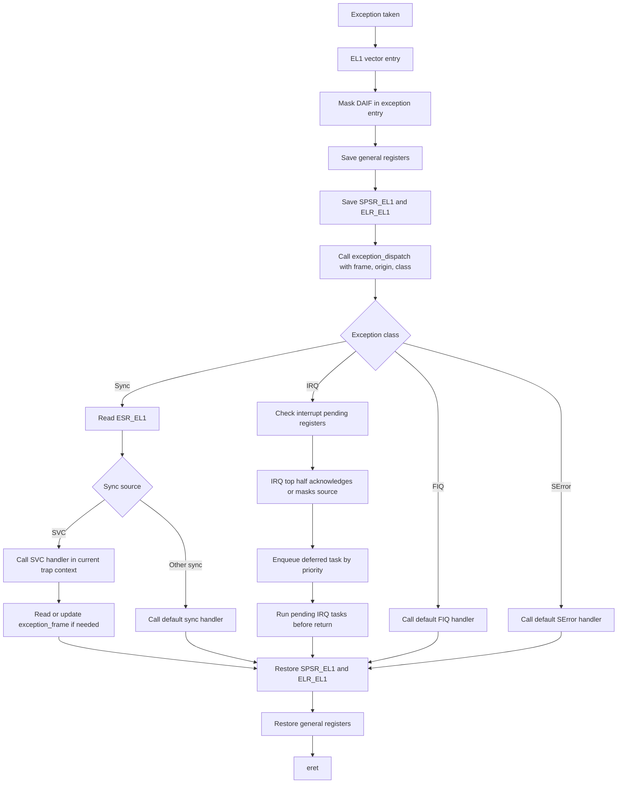

# Lab 3 Note

Lab 3 的核心不是某一個 demo command，而是先建立一套可擴充的 exception
handling 架構。SVC、core timer、Mini UART interrupt、timer multiplexing 和 task queue
都應該只是掛在這套架構上的不同事件來源。

比較合理的主線是：

```text
EL2 -> EL1 kernel
    -> install EL1 vector table
    -> exception stub saves context
    -> C dispatcher identifies source
    -> handler/task processes event
    -> restore context
    -> eret
```

先把這條路徑搭穩，後面各 exercise 才不會各自長出一套臨時 exception path。

## 實作總覽

建議把 Lab 3 拆成這幾個架構層完成：

| 層級 | 主要任務 | 可能檔案 |
| --- | --- | --- |
| EL setup | 從 EL2 切到 EL1h，讓 kernel 在 OS privilege 下執行 | `boot.S`, `arm_v8.h` |
| Vector table | 建立 0x800-aligned EL1 vector table，設定 `VBAR_EL1` | `exception.S`, `boot.S` |
| Exception frame | 在 assembly stub 保存/還原 `x0-x30`、`SPSR_EL1`、`ELR_EL1` | `exception.S`, `exception.h` |
| Dispatcher | C dispatcher 讀 `ESR_EL1` 和 interrupt pending registers，判斷事件來源 | `exception.c`, `peripheral.h` |
| Task queue | 提供 interrupt handler 延後執行工作的 priority queue，讓 IRQ path 維持短小 | `task_queue.*`, `exception.c` |
| User program artifact | 建置 spec 提供的 EL0 測試程式，產生可放進 initramfs 的 `user.img` | `Lab3/user/` |
| EL0 SVC demo | 從 initramfs 載入 `user.img`，切到 EL0，處理 user program 的 `svc` | `shell.c`, `el.*`, `exception.*` |
| Core timer IRQ / Timer queue | 啟用 physical timer，並用 one-shot timer multiplex 多個 software timeout | `timer.*`, `exception.c`, `shell.c` |
| UART IRQ | 啟用 Mini UART RX/TX IRQ，改用 buffer 做 async I/O | `mini_uart.*`, `exception.c` |

建議實作順序：

1. 從 Lab 2 複製 kernel，確認 `Lab3/c` 保留 initramfs shell 並可 build/run。
2. 先加入 `Lab3/user/`：把 spec 提供的 EL0 測試程式整理成可建置的 `user.img`；後面的 EL0 SVC demo 會把它放進 initramfs 後載入執行。
3. 在 early boot 加入 EL2 to EL1，確認 kernel 在 EL1h 執行。
4. 建立 exception core：vector table、context save/restore、C dispatcher、basic priority task queue。
5. 接上 EL0 SVC demo：從 initramfs 載入 `user.img` 到 `0x20000`，設定 `SP_EL0`，用 `eret` 進 EL0，並在 SVC handler 印 `SPSR_EL1`、`ELR_EL1`、`ESR_EL1`。
6. 接 core timer IRQ 和 timer queue：用 physical timer 做 one-shot timeout multiplexing，並提供 `setTimeout [message] [seconds]` demo；timer callback 期間先建立可 nested IRQ 的基本 policy。
7. 接 Mini UART IRQ，建立 RX/TX buffer 和 async I/O，並和 timer IRQ 一起驗證 interrupt source masking、priority 和 nested IRQ 行為。

## User Program Artifact

`Lab3/user/` 只負責產生 EL0 測試程式：

| 檔案 | 用途 |
| --- | --- |
| `main.S` | spec 提供的 user program：累加 `x0` 並執行 `svc 0` |
| `linker.ld` | 將 user program link 到 `0x20000` |
| `makefile` | 產生 `build/user.img`，並可 deploy 到 `BootLoader/rootfs/user.img` |

建置流程是先把 `main.S` 組成 `build/main.o`，再用 `linker.ld` 連結成
`build/user.elf`，最後用 `objcopy -O binary` 取出 raw binary `build/user.img`。
Kernel 後續會把這個 raw image 從 initramfs 複製到 `0x20000` 執行，因此 linker
script 的起始位址、kernel 載入位址和 shell command 裡使用的 entry address 必須一致。

這個目錄不依賴 kernel exception handler，因此可以在 exception core 完成前先建置：

```bash
make -C Lab3/user
```

若要放進共用 initramfs：

```bash
make -C Lab3/user deploy
make -C BootLoader initramfs
```

## EL Setup

Raspberry Pi 3 firmware/QEMU 預設會讓 kernel 從 EL2 開始跑，但 lab 希望 kernel 在
EL1、user program 在 EL0。

```text
firmware/QEMU -> _start at EL2
              -> configure HCR_EL2/SPSR_EL2/ELR_EL2
              -> eret to EL1h
              -> kernel main
```

EL2 to EL1 的重點：

| Register | 用途 |
| --- | --- |
| `HCR_EL2` | 設定 lower EL 使用 AArch64 |
| `SPSR_EL2` | 指定 `eret` 後進入 EL1h，並先 mask DAIF |
| `ELR_EL2` | 指向 EL1 kernel entry |

這些 bit value 建議集中在 `arm_v8.h`，不要在 assembly 裡裸寫 `0x3c5` 這類 magic
number。讀 code 時應該能直接看出「回 EL1h 且 mask DAIF」。

## Exception Core

Exception core 是本 lab 最重要的基礎建設。它不應該只為了 SVC demo 存在，而是要同時
支援後面的 timer IRQ、UART IRQ、nested interrupt 和 task queue。

### Vector Table

CPU 發生 exception 後會根據 `VBAR_EL1` 找到 vector table。table base 必須 0x800
aligned，每個 entry 是 0x80 bytes。vector entry 空間很小，所以 entry 裡只做固定流程，
真正邏輯交給 C proxy/dispatcher。

本 lab 主要會用到：

| Entry | 用途 |
| --- | --- |
| Current EL with SP_ELx, Sync | kernel 自己發生 synchronous exception |
| Current EL with SP_ELx, IRQ | kernel 開 EL1 IRQ 後收到 interrupt |
| Lower EL AArch64, Sync | EL0 user program 執行 `svc` |
| Lower EL AArch64, IRQ | EL0 user program 被 timer/UART interrupt 打斷 |

早期可以讓 entries 先共用同一個 `exception_entry`，但 frame layout 和 dispatcher 介面要
先設計好，避免後續為 timer/UART 大改。

### Entry, Dispatcher, and Handler

建議把角色分清楚：

| 名稱 | 所在 | 職責 |
| --- | --- | --- |
| vector entry | assembly | ARMv8 vector table 的固定入口；依來源 context 和 exception class 跳到對應 assembly stub |
| assembly stub | assembly | 一律 mask DAIF、保存 context、呼叫 C dispatcher、還原 context、`eret` |
| C dispatcher | C | 接收 origin/class，讀 `ESR_EL1` 或 interrupt pending registers，判斷來源並分派給 handler/task |
| sync handler | C | 直接處理 SVC 等 synchronous exception，必要時修改 exception frame |
| IRQ top half | C | acknowledge 或 mask interrupt source，將較重工作 enqueue 成 deferred task |
| deferred task handler | C | 在 task queue 中處理 timer、UART 等 IRQ 延後工作 |

標準流程會先依 vector entry 區分 exception class，再交給 dispatcher 決定處理方式。
目前主要實作 Sync 和 IRQ；FIQ、SError 先接到 default handler，保留之後擴充的入口。



Exception entry 一開始一律 mask DAIF，避免 handler 尚未保存完整 context 時又被其他
exception 打斷。Assembly stub 不決定 nested policy，只負責保護現場；是否重新開 IRQ 由
C dispatcher、IRQ top half 或 task queue 在已保存 context 的安全區段中決定。FIQ 和 SError 先
維持 masked，等有明確 handler 後再開放。

> 目前 FIQ 和 SError 不實作實際功能，但 vector table 和 dispatcher 會保留對應入口，讓
> 後續新增 handler 時不需要改動 exception frame 或 entry path。

### Exception Frame

User program 和 exception path 共用 general purpose register bank。只要 C function
呼叫 `printf` 或任何一般 C function，就會破壞 caller-saved registers。因此進 C 前必須保存
完整 user context。

最少應保存：

| 欄位 | 原因 |
| --- | --- |
| `x0-x30` | user/kernel 共用 general purpose registers |
| `SPSR_EL1` | exception 發生前的 PSTATE；`eret` 需要用它恢復狀態 |
| `ELR_EL1` | exception return address；handler 可視需求修改它 |

建議讓 assembly frame layout 對應 C struct，例如：

```c
typedef struct {
    uint64_t regs[31];
    uint64_t reserved;
    uint64_t spsr_el1;
    uint64_t elr_el1;
} exception_frame_t;

void exception_dispatch(exception_frame_t *frame,
                        exception_origin_t origin,
                        exception_class_t exception_class);
```

這樣 C dispatcher 和各 handler 可以安全讀寫 `frame->regs[0]`、`frame->elr_el1` 等欄位，不需要到處散落
magic offset。

### Priority Task Queue

Interrupt handler 應該只完成必要的低階工作，例如確認來源、acknowledge interrupt、mask
device interrupt 或搬走最小量資料。較重的處理放進 task queue，在 exception return 前由
kernel 統一執行。

Task queue 以 priority queue 實作，priority 數值越小代表優先權越高，會越先執行；同
priority 的 task 維持 FIFO 順序。Task node 可由 simple heap lazy allocation 取得，完成後
回收到 free list 重用，並用最大 node 數限制總配置量。

> 目前先用 `simple_malloc` 搭配 free list 管理 task node，最多配置
> `CONFIG_TASK_QUEUE_MAX_TASKS` 個 node；pending queue 則用 `list_head_t` intrusive list
> 依 priority 插入。

```c
typedef void (*task_callback_t)(void *data);

typedef enum {
    TASK_PRIORITY_TIMER,
    TASK_PRIORITY_UART,
} task_priority_t;

bool task_queue_push(task_priority_t priority, task_callback_t callback, void *data);
void task_queue_run(void);
```

Synchronous exception 例如 SVC 直接在目前的 trap context 中處理，因為它通常需要讀寫
當下的 `exception_frame_t`，例如設定 return value 或調整 return address。IRQ 則採用
top half / deferred task 的分工：dispatcher 確認 interrupt source 並完成 acknowledge 或
mask，較重的 timer/UART work 再 enqueue 到 priority task queue。

## EL0 SVC Demo

`Lab3/user/main.S` 會做：

```asm
mov x0, 0
1:
    add x0, x0, 1
    svc 0
    cmp x0, 5
    blt 1b
1:
    b 1b
```

這個 demo 的目的是驗證：

1. kernel 可以從 EL1 `eret` 到 EL0。
2. EL0 執行 `svc` 會回到 EL1 vector table。
3. handler 可以保存 context，呼叫 C code 印 `SPSR_EL1`、`ELR_EL1`、`ESR_EL1`，再 `eret` 回 EL0。
4. `x0` 不會被 handler 破壞，因此 user program 可以累加到 5。

User program 目前放在 `Lab3/user/`，link address 是 `0x20000`。shell command `svc`
預設會從 initramfs 載入 `user.img`，也可以用 `svc [path]` 指定其他檔名：

```text
svc [path]
    -> find user.img in initramfs
    -> copy image to 0x20000
    -> call el_enter_el0(entry, stack)
    -> set SPSR_EL1 to EL0t with DAIF masked
    -> set ELR_EL1 to 0x20000
    -> set SP_EL0 to 0x22000
    -> eret
```

因為 spec 的 user program 最後會停在 EL0 無限迴圈，所以 demo 完成後不會回 shell
prompt。這是預期行為，不是 shell 壞掉。

## Core Timer IRQ and Timer Queue

Core timer IRQ 不應該建立另一套 exception path，而是接到同一個 exception core：

```text
setTimeout [message] [seconds]
    -> record expires_at = now + seconds
    -> insert event into timer queue by expires_at
    -> if event becomes queue head, run expired events and reprogram physical timer

physical timer expires
    -> lower/current EL IRQ entry
    -> save context
    -> dispatcher checks core local interrupt source
    -> timer handler disables current one-shot timer
    -> pop and run all expired timer callbacks
    -> program next waiting event if any
    -> restore context
    -> eret
```

啟用 basic timer IRQ 需要：

| 步驟 | 操作 |
| --- | --- |
| 初始化 timer 模組 | 讀 `cntfrq_el0`，記錄 counter frequency |
| 允許 EL1 存取 counter/timer | 在 EL2 設定 `CNTHCTL_EL2.EL1PCTEN/EL1PCEN` |
| 啟用 physical timer | `cntp_ctl_el0 = 1` |
| 設定 timeout | 寫 `cntp_tval_el0`，依 queue head 設定下一個 one-shot deadline |
| route core0 timer IRQ | `CORE0_TIMER_IRQ_CTRL` 寫 physical non-secure timer IRQ bit |
| 開 CPU IRQ | kernel 進入 shell 前清掉 DAIF 的 IRQ mask |

handler 可用 `cntpct_el0 / cntfrq_el0` 算 boot 後秒數。

Core timer 是 one-shot timer，一次只能設定一個 expiry。因此 software timer queue 依
`expires_at` 排序，queue head 代表下一個硬體 timer deadline。若同一時間到期，維持 FIFO
順序。

```text
timer_add_timeout(seconds, message)
    -> allocate timer_event_t from simple heap / free list
    -> expires_at = cntpct_el0 + seconds * cntfrq_el0
    -> insert event by expires_at
    -> if new event is queue head:
           run expired events directly
           reprogram hardware timer for next unexpired event

timer_handle_irq()
    -> disable physical timer
    -> while queue head is expired:
           pop event
           run callback
           recycle event
    -> program next queue head
```

`setTimeout` 是 non-blocking demo command。為了方便 demo，沒有參數時使用預設值：

```text
setTimeout
    -> message = "timeout"
    -> seconds = 2

setTimeout MESSAGE SECONDS
    -> message = MESSAGE
    -> seconds = SECONDS
```

timeout callback 會先清掉目前 shell prompt line，印出 timeout 訊息，再把使用者輸入到
一半的 buffer 重畫回來：

```text
[Timeout at 6 seconds since booting]: timeout
```

## Mini UART IRQ

Mini UART interrupt 的重點是把 polling I/O 改成 buffered async I/O。它仍然掛在同一個
exception dispatcher 下：

```text
UART RX ready
    -> IRQ
    -> dispatcher checks AUX pending/source
    -> RX handler copies byte into read buffer

UART TX ready
    -> IRQ
    -> dispatcher checks AUX pending/source
    -> TX handler drains write buffer
```

需要設定：

| Controller | Register | 設定 |
| --- | --- | --- |
| Mini UART | `AUX_MU_IER` | enable RX/TX interrupt |
| BCM peripheral IRQ | `ENABLE_IRQS1` at `0x3f00b210` | set bit 29 for AUX interrupt |

Buffer 操作要保護 critical section。簡單作法是在操作 RX/TX buffer 前暫時 mask 對應 IRQ，
操作完再打開。

## IRQ Priority and Nesting Policy

Nested IRQ 和 priority/preemption 不是獨立於 interrupt source 的單一步驟，而是 timer
IRQ、UART IRQ 在實作時共同遵守的 policy。只有 timer IRQ 時，可以先驗證 callback 期間
允許 nested IRQ；接上 UART IRQ 後，才有足夠的事件來源驗證不同 IRQ task 的 priority 和
device interrupt masking 是否正確。

Priority task queue 建立後，IRQ deferred work 可以逐步擴充成可 nested、可 preempt 的
task flow：

1. IRQ handler 判斷來源。
2. mask 該 device interrupt。
3. 搬走必要資料或記錄狀態。
4. enqueue task。
5. 在 context 已保存且目前 interrupt source 已被 ack/mask 後，進入可 nested 的 task
   execution 區段。
6. task queue 或 deferred task handler 視情況 unmask IRQ，讓其他 IRQ source 可以進來。
7. 離開 task execution 區段前再次 mask IRQ。
8. task 完成後 unmask device interrupt。

目前 nested policy 只針對 IRQ，不包含 FIQ、SError 或 Debug exception。其他 exception
class 尚未建立 queue、handler 和 priority policy，因此先保持 masked；等有明確來源與處理
策略後再開放。

為了 nested IRQ 正確，exception frame 必須保存 `SPSR_EL1` 和 `ELR_EL1`，否則內層
interrupt 會覆蓋外層 return state。

Priority task queue 可以先用「priority + FIFO」：

```text
lower priority value => higher priority
timer task priority < UART task priority
```

回到前一層 handler 前可以檢查是否有更高 priority task，若有則先執行它，形成簡單
preemption。

## Build and Run

建置 kernel：

```bash
make -C Lab3/c
make -C Lab3/c qemu
```

建置並部署 spec user program 到共用 rootfs：

```bash
make -C Lab3/user deploy
make -C BootLoader initramfs
```

EL0 SVC demo：

```text
$ svc
Loaded user.img to 0x00020000 (...)
Entering EL0 user program.
SVC #0 from lower_aarch64: x0 = 1
SPSR_EL1 = 0x3c0
ELR_EL1  = 0x2000c
ESR_EL1  = 0x56000000
...
SVC #0 from lower_aarch64: x0 = 5
SPSR_EL1 = 0x800003c0
ELR_EL1  = 0x2000c
ESR_EL1  = 0x56000000
```

Timer queue demo：

```text
$ setTimeout
<Timer>: current time: 0 seconds since booting.
[Timeout at 2 seconds since booting]: timeout
$
$ setTimeout first 3
<Timer>: current time: 3 seconds since booting.
$ setTimeout second 1
<Timer>: current time: 4 seconds since booting.
[Timeout at 5 seconds since booting]: second
[Timeout at 6 seconds since booting]: first
$
```

若使用共用 UART bootloader 上傳 actual kernel：

```bash
make lab3 SERIAL_PORT=/dev/ttyUSB0
python3 KernelUploader.py --kernel ./Lab3/c/bin/kernel8.img --port /dev/ttyUSB0
```

## References

- `Lab3/spec.pdf`
- Lab 3 online spec: `https://nycu-caslab.github.io/OSC2024/labs/lab3.html`
- ARMv8-A exception levels and exception handling
- BCM2837 ARM Peripherals interrupt controller
- Raspberry Pi 3 core local interrupt controller
